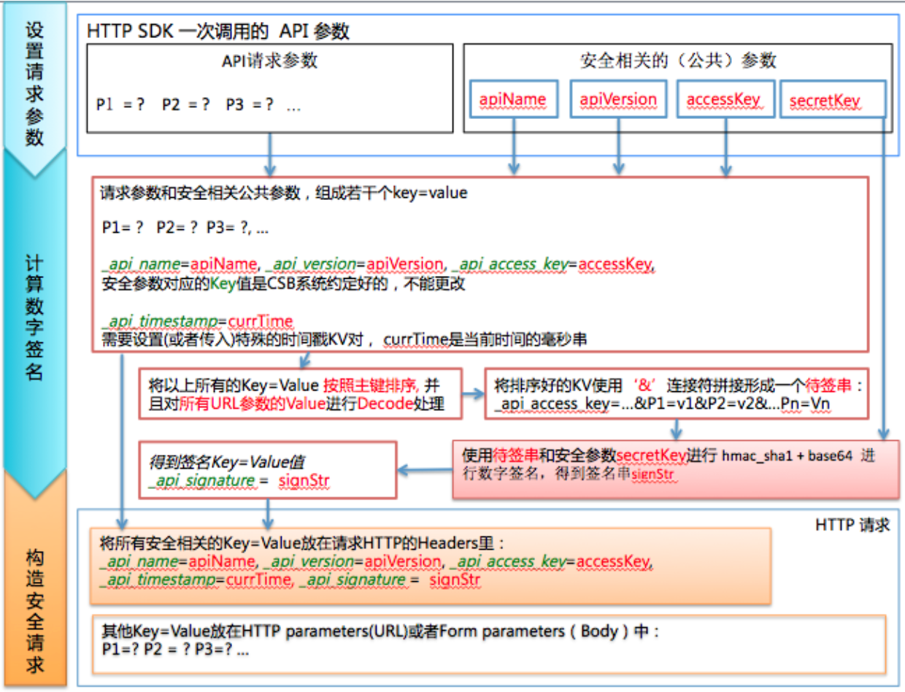

# HTTP SDK README

HTTP SDK工具类，用来向服务端发送HTTP请求，请求支持POST/GET方式。如果提供了AccessKey和SecurityKey参数信息，它能够在内部将请求消息进行签名处理，然后向CSB服务端发送进行验证和调用。

## 0. CSB发布出的Restful服务的访问地址
地址访问格式： http://broker-vip:8086/CSB
* broker-vip 是CSB-Broker的前置SLB地址或者具体的一个broker的地址(当没有前置的SLB或者Proxy)
* 默认的访问端口为 "8086"
* 请求的context-path可以任意指定，默认使用“CSB”

## 1. 工具包的下载地址

* 如果使用命令行方式调用SDK,则需要将standalone的运行包放在调用端的CLASSPATH环境里

[最新的包 http-sdk-1.1.5.1.jar](http://middleware-udp.oss-cn-beijing.aliyuncs.com/components/csb/CSB-SDK/http-client-1.1.5.1.jar)

[次新的包 http-sdk-1.1.4.0.jar](http://middleware-udp.oss-cn-beijing.aliyuncs.com/components/csb/CSB-SDK/http-sdk-1.1.4.0.jar)

[旧的http-sdk-1.0.4.2plus.jar](http://middleware-udp.oss-cn-beijing.aliyuncs.com/components/csb/CSB-SDK/http-sdk-1.0.4.2plus.jar)

* 如果用编程的方式,可以不下载这个standalone的Jar包,而是在用户的pom.xml里引用如下的dependency:

```
<dependency>
  <groupId>com.alibaba.csb.sdk</groupId>
  <artifactId>http-client</artifactId>
  <version>${ws.sdk.version}</version>
</dependency>
```
注意: 具体版本请参考[release](../release.md)里的说明,推荐使用最新版本

## 2. HTTP Client SDK 使用方式

### 方式一: 使用命令行直接调用
这个方式适合开发测试使用，不需要编写代码，快速地查看一个服务是否可通可用。

```
java [sys-props] -jar http-sdk-1.1.5.1.jar [options...]
```

参数取值说明:
 -ak <arg>        accessKey, 可选
 -api <arg>       服务名
 -D <arg>         请求参数, 格式: -D "key=value" 可以定多个-D参数
 -d,--debug       打印调试信息
 -H <arg>         http header, 格式: -H "key:value" 可以定义多个-H参数
 -h,--help        打印帮助信息
 -method <arg>    请求类型, 默认get, 可选的值为: get, post, cget和cpost
 -nonce           -nonce 是否做nonce防重放处理，不定义为不做nonce重放处理
 -proxy <arg>     设置代理地址, 格式: proxy_hostname:proxy_port
 -sk <arg>        secretKey, 可选
 -url <arg>       请求地址，e.g: http://broker-ip:8086/CSB?p1=v1
 -version <arg>   服务版本
 -signImpl        客户端签名类
 -verifySignImpl  CSB服务端验签类
 -cbJSON          以JSON串方式post发送的请求body, 例如: -cbJSON '{"name":"wiseking"}'
 -cc,--changeCharset   返回值是否需要转换charset


* **sys-props**      为可选的**JVM系统参数**, 可以设置如下的一项或者多项（空格分隔），具体包括：
  * -Dtest.stress.times=n   压测或者限流测试时使用的参数，一次命令行调用可以发起n次调用
  * -Dhttp.caller.DEBUG=true    命令行打开调试模式

* 注意：上述命令行方式在1.1.5.1版本支持, 如果是有之前的版本命令行方式有所不同,[详见](https://github.com/aliyun/csb-sdk/blob/1.0.4.x/http-client/README.md)

### 方式二: 使用编程方式调用

```
 import com.alibaba.csb.sdk.HttpCaller;
 import com.alibaba.csb.sdk.HttpCallerException;
 ...
```

  **注意：**在编程方式调用时，首先要在整个JVM范围内启动一次HttpCaller.warmup()来加载SDK所需要的类,
  否则在第一次调用HttpCaller的doGet/doPost/invoke等方法时会很慢(~5s)

```
  HttpCaller.warmup();
```

  (1) 使用Builder的方式构造调用参数，然后进行调用 （推荐用法）

```  
 import com.alibaba.csb.sdk.HttpParameters;
 import com.alibaba.csb.sdk.HttpCaller;
 import com.alibaba.csb.sdk.HttpCallerException;
 
  
  HttpParameters.Builder builder = HttpParameters.newBuilder();
      
  builder.requestURL("http://broker-vip:8086/CSB?arg0=123") // 设置请求的URL
      .api("test") // 设置服务名
      .version("1.0.0") // 设置版本号
      .method("get") // 设置调用方式, get/post
      .accessKey("ak").secretKey("sk"); // 设置accessKey 和 设置secretKey
      
   // 设置请求参数
   builder.putParamsMap("key1", "value1");
   builder.putParamsMap("key2", "{\"a\":value1}"); // json format value
      
   //设置请求调用方式
   builder.method("get");
      
   //设置透传的HTTP Headers
   builder.putHeaderParamsMap("header1", "value1");
   builder.putHeaderParamsMap("header2", "value2");
   
   //设置是否生成防重放Nonce, 默认值是false, 这个功能仅在SDK1.1.4及CSB-Broker 1.1.2后支持
   builder.nonce(true);
      
   //进行调用 返回结果
   String result = null;
   try {
      	result = HttpCaller.invoke(builder.build());
      	// 或者使用下面的调用方法, 可以返回更多的信息，包括诊断信息,这个功能仅在SDK1.1.4.0以后版本支持
      	HttpReturn res = HttpCaller.invokeReturn(builder.build()); //然后在res里获取相关的信息
      	
      	
        // 如果期望获取返回的http headers, 则需要在invoke中加入第二个参数，如下：
        // 用这个参数变量获取调用后返回的http headers, 内容为
        //   {"header1":"value1","header2":"value2",...}
        StringBuffer resHttpHeaders = new StringBuffer(); 
        result = HttpCaller.invoke(builder.build(), resHttpHeaders);
        
      
        //注：如果返回结果出现乱码(不能正常显示中文),可以使用串字符集转换方法进行转换
        result = HttpCaller.changeCharset(result);
   } catch (HttpCallerException e) {
      	// error process
   }
   
   //再次进行调用 返回结果   
   try {
      	// 重启设置请求参数
      	builder.clearParamsMap();
      	builder.putParamsMap("key1", "value1---new");
      	builder.putParamsMap("key2", "{\"a\":\"value1-new\"}");
      
      	// 使用post方式调用
      	builder.method("post");
      	result = HttpCaller.invoke(builder.build());
   } catch (HttpCallerException e) {
      	// error process
   }
```

 (2) 如果使用json或者bytes内容的作为http body，使用下面的方法

```
  //构造ContentBody对象
  ContentBody cb = new ContentBody(jsonObject.toSring());
  //或者
  cb = new ContentBody(file2bytes);
     
  //ContentBody传递，要求使用post方式进行调用
  //如果需要传递请求参数 可以拼接到请求URL中，或者设置paramsMap参数由SDK内部进行拼接
  HttpParameters.Builder builder = HttpParameters.newBuilder();      
  builder.requestURL("http://broker-vip:8086/CSB?arg0=123") // 设置请求的URL,可以拼接URL请求参数
      .api("test") // 设置服务名
      .version("1.0.0") // 设置版本号
      .method("post") // 设置调用方式, 必须为 post
      .accessKey("ak").secretKey("sk"); // 设置accessKey 和 设置secretKey
     
  builder.contentBody(cb);
      
  //进行调用，返回结果
  String result = null;
  try {
      	result = HttpCaller.invoke(builder.build());
  } catch (HttpCallerException e) {
      	// error process
  }     
```

 (3) 直接调用方式 (旧的使用方式，已过期，不推荐)

```
 Map<String,String> params = new HashMap<String,String>();
    
 Object smd = ... // 一个具体的复杂对象
 if (smd != null) {
   String data = JSON.toJSONString(smd); //转换为JSON String
   params.put("data", data);
 }
 
 // -- Tip: 如果调用者无法获得复杂对象参数类，则可以使用全map的方式设置json串，举例，对于json串
 // {"f1":{"f11":"v11", "f12":["v121","v122"]}, "f2":"wiseking"}
 // 它是可以通过如下的方式进行转换而来
 Map map = new HashMap();
 
 Map mapF1 = new HashMap();
 mapF1.put("f11", "v11");
 mapF1.put("f12", Arrays.asList("v121","v122"));
 map.put("f1", mapF1);
 
 map.put("f2", "wiseking");
 String jsonData = JSON.toJSONString(map);
 // -- Tip End
 
 params.put("name", "abcd"); //普通的串对象
 params.put("password", "abcd"); //普通的串对象
 
    
 String requestURL = "http://broker-vip:8086/CSB";
 String API_NAME = "login_system";
 String version = "1.0.0";
 String ak = "xxxxxx";
 String sk = "xxxxxx"; //用户安全校验的签名密钥对
    
 try {
   String result = HttpCaller.doPost(requestURL, API_NAME, version, params, ak, sk);
    
   if (result != null) {
      //返回结果处理, 如转换为JSON对象
      ...
   }
 } catch (HttpCallerException ie) {
      //print error
 }}
 
```

## 4. 附录 
### 4.1. 签名机制的说明
如果CSB 控制台发布出来的HTTP 服务声明需要鉴权处理，则客户端调用该服务试CSB 要对每个访问请求进行身份验证。这就要求客户端无论使用HTTP 还是HTTPS协议提交请求，都需要在请求中包含签名（Signature）信息。
CSB通过使用Access Key ID 和Access Key Secret进行对称加密的方法来验证请求的发送者身份。 Access Key ID 和Access Key Secret由在管理控制台在服务订购时候指定和确认，HTTP SDK在访问时，按照下面的方法对请求进行签名处理：

1 使用请求参数构造规范化的请求字符串（Canonicalized Query String）。
  a.  按照参数名称的字典顺序对请求中所有的请求参数，包括上文中中描述的“公共请求参数”（但不包括_api_signature 参数本身）和给定了的请求接口的自定义参数进行排序。
  说明：当使用GET方法提交请求时，这些参数就是请求URI中的参数部分（即URI 中“?”之后由“&”连接的部分）。

  b.  参数名称和值使用英文等号（=）进行连接。再把英文等号连接得到的字符串按参数名称的字典顺序依次使用&符号连接，即得到规范化请求字符串。
  注意：请求参数是原始的name-value，即不能进行URL Encode等操作。

2 按照RFC2104 的定义，使用上述用于签名的字符串计算签名HMAC 值。注意：计算签名时使用的Key 就是用户持有的SecretKey，使用的哈希算法是SHA1。

3 按照Base64编码规则把上面的HMAC值编码成字符串，即得到签名值（Signature）。

4 将得到的签名值作为_api_signature参数添加到请求参数中，即完成对请求签名的过程。

####  HTTP SDK 签名处理的图示



####  请求参数中包含中文导致签名验证失败的问题
SDK在将参数签名完成后，在发送给服务端之前，会把请求参数进行URLEncoder编码，编码方式为当前Java系统中的file.encoding系统参数所指定的值。如请求参数中包含有中文，并且客户单的系统Charset编码参数与服务端的不一致的时候，当使用GET方式调用就可能出现验签失败的问题；当这种情况发生时要检查两端的Charset编码是否一致， 可以在SDK客户端设置编码方式(如: -Dfile.encoding=UTF-8)使编码与服务器一致。如果你的中文参数是写死在Java程序代码中，需要保证源码的编码方式与服务端要求的一致，否则也会出现签名失败的问题.

### 4.2. 高级功能
#### 设置代理地址 （注意：从1.1.4开始支持）

```
  String proxyHost = "...";
  int proxyPort = ...;
  HttpCaller.setProxyHost(proxyHost, proxyPort, null); //注意：本次设置只对本线程起作用
  ...
  HttpCaller.doPost(), doGet() or invoke();

```

#### 关于连接参数的设置：
* 可以为http/https设置以下的全局性系统参数：

```
      -Dhttp.caller.connection.max          设置连接池的最大连接数，默认是200
      -Dhttp.caller.connection.timeout      设置连接超时时间（毫秒），默认是-1， 永不超时
      -Dhttp.caller.connection.so.timeout   设置读取超时时间（毫秒），默认是-1， 永不超时
      -Dhttp.caller.connection.cr.timeout   设置从连接池获取连接实例的超时（毫秒），默认是-1， 永不超时      
      -Dhttp.caller.skip.connection.pool    如果设置为true,则不使用连接池。默认行为是false,使用连接池(支持长连接)
      -Dhttp.caller.connection.async        设置内部使用nio,默认fasle:同步io,true:nio（不支持连接池，不推荐使用）
```

* 也可以使用下面的方法设置以上的某一个或者多个参数：

```
      Map sysParams = new HashMap();
      sysParams.put("http.caller.connection.timeout","3000"); //设置连接超时为3秒
      HttpCaller.setConnectionParams(sysParams); //注意：本次设置只对本线程起作用
      ...
      HttpCaller.doPost() or doGet();
```

#### 自定义签名和验签类 （注意：从1.1.5.1开始支持）
详细使用请参考 [1.1.5.1发布说明](release/r20181031.md) 。客户端示意代码：
```
   builder.requestURL("http://localhost:8086/CSB").api("PING").version("vcsb").method("get") .accessKey("ak").secretKey("sk")
            .signImpl("your-sign-impl-class").verifySignImpl("your-verify-sign-impl-class"); //指定客户端签名类 和 CSB服务端验签类
  ...
  HttpCaller.doPost(builder.build()), doGet(builder.build()) or invoke(builder.build());
```

### 4.3. 使用http-sdk调用CSB控制台的Open API

使用HTTP-SDK可以对控制台提供的OpenAPI进行调用,具体的例子[参见](InvokeOpenAPI.md)

### 4.4. 在无Java对象的情况下，使用泛化的形式转换json串的工具

```
  一个辅助工具类Java对象到JSON串的泛化转换，在不定义复杂对象类的情况下，把HTTP参数转换为Json串

 用法：
 
 import static com.alibaba.csb.sdk.ParamJSONHelper.*;
 
  ...
  Map orderItemElement = toMap(
    toKVPair("skey1", "foo"), 
    toKVPair("skey2", "bar"));
  Map orderItem = toMap(toKVPair("orderItem", orderItemElement));
  Map itemElement = toMap(
    toKVPair("key1", "love"), 
    toKVPair("key2", "story"),
    toKVPair("orderItems", Arrays.asList(orderItem)));
  Map item = toMap(toKVPair("item", itemElement));
  // 调用fastjson类 将Map所代表的对象内容装换为json串
  String poItems = JSON.toJSONString(Arrays.asList(item), true);
      
  System.out.println("poItems=\n" + poItems);
 
 打印出的JSON串为:
 
 [
	{
		"item":{
			"key1":"love",
			"key2":"story",
			"orderItems":[
				{
					"orderItem":{
						"skey1":"foo",
						"skey2":"bar"
					}
				}
			]
		}
	}
 ]
```


