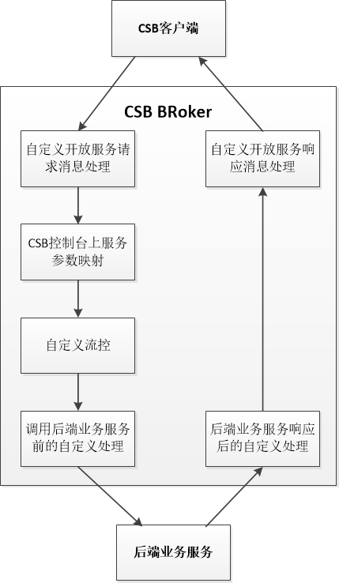

# CSB用户自定义扩展说明
## 自定义流控
### 功能描述
CSB在流控处理逻辑中，自动调用用户自定义的流控逻辑，用户根据服务名、请求者accessKey等信息判断是否允许当前请求继续执行。

例如用户可以基于此扩展功能机制实现按天的流量配额等功能。

### 扩展接口定义
```java
public interface SelfDefFlowControl {
    static final String TRACE_ID = "_inner_ecsb_trace_id"; //CSB服务请求唯一标识
    static final String CSB_INTERNAL_NAME = "_csb_internal_name_"; // CSB实例名
    static final String CSB_BROKER_IP = "_csb_broker_ip"; //CSB Broker节点的IP
    static final String API_NAME = "_api_name"; //CSB服务名
    static final String API_VERION = "_api_version"; // CSB服务版本号
    static final String API_GROUP = "_api_group"; // CSB服务所属服务组名
    static final String USER_ID = "userId"; //服务访问者用户Id
    static final String CREDENTIAL_NAME = "credentail_name"; //服务访问者凭证名
    static final String ACCESS_KEY = "_api_access_key";  //服务访问者的ak
    static final String REMOTE_PEER_IP = "_remote_peer_ip";  //服务访问者IP

    /**
     * 服务请求上下文信息map，各信息的key见上述常量定义
     *
     * @throws LimitExceedException 如果流控异常，则终止服务后续处理流程，将异常信息返回给CSB客户端
     */
    void process(Map<String, Object> contextMap) throws LimitExceedException;
}
```
用户的自定义扩展java代码实现此接口即可。

如果用户希望终止当前请求，则抛出 `LimitExceedException`异常即可。此时CSB客户端将收到的响应结果为“`LimitExceedException的异常信息描述`”。
### 使用说明
本扩展功能基于Java SPI规范实现：
* [引用接口包 user-extend-client.1.1.6.0.jar](http://middleware-udp.oss-cn-beijing.aliyuncs.com/components/csb/CSB-SDK/user-extend-client-1.1.6.0.jar) 
* 实现`com.alibaba.csb.sentinel.SelfDefFlowControl`的 `process` 方法。
* 在用户jar包的classpath路径下定义`META-INF/services/com.alibaba.csb.sentinel.SelfDefFlowControl`文件，文件内容如下：
```text
#用户自定义流控扩展逻辑Java实现类全名，示例如下
com.alibaba.csb.sentinel.DemoSelfDefFlowControlImpl
```
* 用户将扩展逻辑打成jar包，上传到CSB Broker的Docker内`/home/admin/cloud-gateway/patchlib`目录内。
* 重启docker实例。
### demo示例
```java
public class DemoSelfDefFlowControlImpl implements SelfDefFlowControl {

    public void process(Map<String, Object> contextMap) throws LimitExceedException {
        System.out.println("自定义流控逻辑" + contextMap.toString());
        throw new LimitExceedException("自定义流控限制当前请求: " + contextMap.get(TRACE_ID));
    }
}
```

## 自定义开放服务请求/响应消息处理
### 功能描述
* 自定义开放服务请求消息处理：CSB broker接收到CSB客户端发来的请求后，调用此扩展逻辑 ，然后进行CSB控制台界面上的服务参数映射。用户可根据CSB实例名、CSB服务名、CSB凭证、后端业务服务地址、请求头、请求体等信息进行逻辑处理：
    * 修改、增加、删除请求头。
    * 返回新的请求body对象。
    * 在服务请求消息处理中，可以设置 `_self_`开关的自定义key_value，以便在后续自定义扩展逻辑里使用。
    * 抛出异常，以便中止服务处理，不再转发请求给后端业务服务。
* 自定义开放服务响应消息处理：CSB broker返回结果消息给CSB客户端之前，调用此扩展逻辑。用户可根据CSB实例名、CSB服务名、CSB凭证、响应头、响应体等信息进行逻辑处理：
    * 修改、增加、删除响应头。
    * 返回新的响应body对象。
    * 抛出异常，以便中止服务处理。

### 条件与约束
* 仅支持对外开放为 HTTP和WS 的服务。
* 对外开放为WS服务时，暂未提供HttpHeader的入参、增加或修改能力。

### 扩展接口定义
```java
public interface ServerMessageProcessInterceptor extends BaseSelfDefProcess {
     /**
     * 请求消息处理:收到客户请求后调用。用户可以：
     * <ul>
     * <li>  增加、修改、删除：请求头</li>
     * <li>  修改：通过retrun新的请求body，达到修改body的目标。如果是form请求，则直接body是map《String，List《String》》。如果是非form的文本请求，则body是String。其它请求，则是InputStream或byte[]对象</li>
     * <li>  保存自定义数据到服务处理上下文：直接put("_self_前缀的key",自定义value)</li>
     * <li>  抛出异常，以中止服务处理，异常消息将直接返回给CSB客户端</li>
     * </ul>
     *
     * @param contextMap 服务请求上下文信息map，各信息的key见 BaseSelfDefProcess 常量定义:
     *                   <ul>
     *                   <li> _biz_id 请求业务id</li>    
     *                   <li> _inner_ecsb_trace_id CSB服务请求唯一标识</li>
     *                   <li> _csb_internal_name_  CSB实例名</li>
     *                   <li>_csb_broker_ip  CSB Broker节点的IP</li>
     *                   <li>_api_name  CSB服务名</li>
     *                   <li>_api_version  CSB服务版本号</li>
     *                   <li>_api_group  CSB服务所属服务组名</li>
     *                   <li>_api_owner_id  服务拥有者用户Id</li>
     *                   <li>userId  服务访问者用户Id</li>
     *                   <li>credentail_name  服务访问者凭证名</li>
     *                   <li>_api_access_key  服务访问者的ak</li>
     *                   <li>_remote_peer_ip  服务访问者IP</li>
     *                   <li>_remote_real_ip  后端业务服务提供者IP</li>     
     *                   <li>server_protoco  开放协议</li>     
     *                   <li>backend_Protoco  后端服务协议</li>          
     *                   <li>request_headers  请求http头</li>
     *                   <li>request_body，如果是form请求，则直接body是map。如果是非form的文本请求，则body是String。其它请求，则是InputStream或byte[]对象</li>
     *                   </ul>
     * @return 处理后的请求body
     * @throws SelfDefProcessException
     */
    Object requestProcess(Map<String, Object> contextMap) throws SelfDefProcessException;
    
     /**
         * 响应消息处理:向客户发送响应结果之前调用
         * <ul>
         * <li>  增加、修改、删除：响应头</li>
         * <li>  修改：通过retrun新的响应body，达到修改body的目标。如果响应是文本，则是String对象。否则就是InputStream或byte[]对象。</li>
         * <li>  抛出异常，以中止服务处理，异常消息将直接返回给CSB客户端</li>
         * </ul>
         *
         * @param contextMap 服务请求上下文信息map，各信息的key见 BaseSelfDefProcess 常量定义:
         *                   <ul>
         *                   <li> _biz_id 请求业务id</li>    
         *                   <li> _inner_ecsb_trace_id CSB服务请求唯一标识</li>
         *                   <li> _csb_internal_name_  CSB实例名</li>
         *                   <li>_csb_broker_ip  CSB Broker节点的IP</li>
         *                   <li>_api_name  CSB服务名</li>
         *                   <li>_api_version  CSB服务版本号</li>
         *                   <li>_api_group  CSB服务所属服务组名</li>
         *                   <li>_api_owner_id  服务拥有者用户Id</li>
         *                   <li>userId  服务访问者用户Id</li>
         *                   <li>credentail_name  服务访问者凭证名</li>
         *                   <li>_api_access_key  服务访问者的ak</li>
         *                   <li>_remote_peer_ip  服务访问者IP</li>
         *                   <li>_remote_real_ip  后端业务服务提供者IP</li>     
         *                   <li>response_headers  响应http头</li>
         *                   <li>response_body  如果响应是文本，则是String对象。否则就是InputStream或byte[]对象</li>
         *                   <li>response_exception  响应结果异常：后端业务服务返回的异常，或csb处理响应结果时产生的异常。可能为空</li>
         *                   </ul>
         * @return  处理后的响应body，csb将以此body返回给客户端。可以是string或byte[]
         * @throws SelfDefProcessException
         */
        Object responseProcess(Map<String, Object> contextMap) throws SelfDefProcessException;
}
```

### 使用说明
本扩展功能基于Java SPI规范实现：
* [引用接口包 user-extend-client.1.1.6.0.jar](http://middleware-udp.oss-cn-beijing.aliyuncs.com/components/csb/CSB-SDK/user-extend-client-1.1.6.0.jar) 
* 实现`com.alibaba.csb.selfDefProcess.udfmp.ServerMessageProcessInterceptor`的 `requestProcess`和`responseProcess` 方法。
* 在用户jar包的classpath路径下定义`META-INF/services/com.alibaba.csb.selfDefProcess.udfmp.ServerMessageProcessInterceptor`文件，文件内容如下：
```text
#用户自定义扩展逻辑Java实现类全名
com.abc.csb.ServerMessageProcessInterceptor
```
* 用户将扩展逻辑打成jar包，上传到CSB Broker的Docker内`/home/admin/cloud-gateway/patchlib`目录内。
* 重启docker实例。
### demo示例
```java
public class DemoMessageProcessInterceptor implements ServerMessageProcessInterceptor {

    /**
     * 请求消息处理:收到客户请求后调用
     *
     * @return
     */
    public Object requestProcess(Map<String, Object> contextMap) throws SelfDefProcessException {
        System.out.println("DemoMessageProcessInterceptor.requestProcess contextMap: " + contextMap);
        Map<String, String> headers = (Map<String, String>) contextMap.get(REQUEST_HEADERS);
        headers.put("addReqHeader", "reqHeader1");//增加http请求头

        contextMap.put(SELF_CONTEXT_PREFIX + "Obj1", "self1");//保存自定义上下文

        Object body = contextMap.get(REQUEST_BODY);
        if (body instanceof Map) { //form表单提交的请求
            ((Map) body).put("field1", Arrays.asList("value1"));
        } else if (body instanceof String) { //json和其它文本
            body += " + aaa";  //设置新的请求文本
        }
        return body;
    }

    /**
     * 响应消息处理:向客户发送响应结果之前调用
     *
     * @return
     */
    public Object responseProcess(Map<String, Object> contextMap) throws SelfDefProcessException {
        System.out.println("DemoMessageProcessInterceptor.responseProcess contextMap: " + contextMap);
        Map<String, String> headers = (Map<String, String>) contextMap.get(RESPONSE_HEADERS);
        headers.put("addRspHeader", "rspheader1"); //增加http响应头

        Object body = contextMap.get(RESPONSE_BODY);
        if (body instanceof String) { //json和其它文本
            body += " + response_bbb"; //设置新的响应结果文本
        } else if (body instanceof InputStream) {
            ;
        }
        return body;
    }
}
```


## 调用后端业务服务前的自定义处理
### 功能描述
在CSB broker转发请求给后端业务服务前，自动调用用户自定义的处理逻辑。用户可根据CSB实例名、CSB服务名、CSB凭证、后端业务服务地址、请求头、请求体等信息进行逻辑处理：
1. 修改、增加、删除请求头。
2. 修改、增加、删除URL的query参数。
3. 返回新的请求body对象。
4. 抛出异常，以便中止服务处理，不再转发请求给后端业务服务。

### 条件与约束
当前仅支持后端业务服务是HTTP/HTTPS的服务。

### 扩展接口定义
```java
public interface BeforeSend2BackendHttp extends BaseSelfDefProcess {
    /**
     * 自定义处理逻辑，用户可以：
     * <ul>
     * <li>  增加、修改、删除：请求头</li>
     * <li>  增加、修改、删除：query参数</li>
     * <li>  修改：通过retrun新的响应body，达到修改body的目标。如果是form请求，则直接body是map。如果是非form的文本请求，则body是String。其它请求，则是InputStream或byte[]对象</li>
     * <li>  抛出异常，以中止服务处理，异常消息将直接返回给CSB客户端</li>
   * </ul>
     *
     * @param contextMap 服务请求上下文信息map，各信息的key见 BaseSelfDefProcess 常量定义:
     *                   <ul>
     *                   <li> _inner_ecsb_trace_id CSB服务请求唯一标识</li>
     *                   <li> _csb_internal_name_  CSB实例名</li>
     *                   <li>_csb_broker_ip  CSB Broker节点的IP</li>
     *                   <li>_api_name  CSB服务名</li>
     *                   <li>_api_version  CSB服务版本号</li>
     *                   <li>_api_group  CSB服务所属服务组名</li>
     *                   <li>userId  服务访问者用户Id</li>
     *                   <li>credentail_name  服务访问者凭证名</li>
     *                   <li>_api_access_key  服务访问者的ak</li>
     *                   <li>_remote_peer_ip  服务访问者IP</li>
     *                   <li>_remote_real_ip  后端业务服务提供者IP</li>     
     *                   <li>backend_url  后端业务服务的http地址</li>
     *                   <li>backend_method  请求后端业务服务的http方法：POST、GET等</li>
     *                   <li>request_http_querys  请求后端业务服务的http query：map<String,List<String>> </li>
     *                   <li>request_headers  请求后端业务服务的http头</li>
     *                   <li>request_body，如果是form请求，则直接body是map。如果是非form的文本请求，则body是String。其它请求，则是InputStream或byte[]对象</li>
     *                   </ul>
     * @return 请求body，csb将以此body发送给后端业务服务。如果是form请求，则返回原始request_body对象（map《String,List《String》》），其它情况可以返回string或byte[]。
     * @throws SelfDefProcessException
     */
    Object process(final Map<String, Object> contextMap) throws SelfDefProcessException;
}

```

### 使用说明
本扩展功能基于Java SPI规范实现：
* [引用接口包 user-extend-client.1.1.6.0.jar](http://middleware-udp.oss-cn-beijing.aliyuncs.com/components/csb/CSB-SDK/user-extend-client-1.1.6.0.jar) 
* 实现`com.alibaba.csb.selfDefProcess.BeforeSend2Backend.BeforeSend2BackendHttp`的 `process` 方法。
* 在用户jar包的classpath路径下定义`META-INF/services/com.alibaba.csb.selfDefProcess.BeforeSend2Backend.BeforeSend2BackendHttp`文件，文件内容如下：
```text
#用户自定义扩展逻辑Java实现类全名
com.abc.csb.BeforeSend2BackendHttpClass
```
* 用户将扩展逻辑打成jar包，上传到CSB Broker的Docker内`/home/admin/cloud-gateway/patchlib`目录内。
* 重启docker实例。
### demo示例
```java
public class DemoBeforeSend2BackendHttp implements BeforeSend2BackendHttp {
    public Object process(Map<String, Object> contextMap) throws SelfDefProcessException {
        System.out.println("DemoBeforeSend2BackendHttp.process contextMap: " + contextMap);
        Map<String, String> headers = (Map<String, String>) contextMap.get(REQUEST_HEADERS);
        headers.put("addReqHeader", "reqHeader1");

        Map<String, List<String>> querys = (Map<String, List<String>>) contextMap.get(REQUEST_HTTP_QUERYS);
        querys.put("query1", Arrays.asList("queryValue1"));

        Object body = contextMap.get(REQUEST_BODY);
        if (body instanceof Map) { //form表单提交的请求
            ((Map) body).put("field1", Arrays.asList("value1"));
        } else if (body instanceof String) { //json和其它文本
            body += " + aaa";  //设置新的请求文本
        } else if (body instanceof InputStream) {
            ;
        }
        return body;
    }
}
```


## 后端业务服务响应后的自定义处理
### 功能描述
在CSB broker接收到后端业务服务响应后，自动调用用户自定义的处理逻辑。用户可根据CSB实例名、CSB服务名、CSB凭证、响应头、响应体等信息进行逻辑处理：
1. 修改、增加、删除响应头。
2. 返回新的响应对象。
3. 抛出异常，以便中止服务处理，不再转发请求给后端业务服务。

### 条件与约束
当前仅支持后端业务服务是HTTP/HTTPS的服务。

### 扩展接口定义
```java
public interface AfterResponseFromBackendHttp extends BaseSelfDefProcess {
    /**
     * 自定义处理逻辑，用户可以：
     * <ul>
     * <li>  增加、修改、删除：响应头</li>
     * <li>  修改：通过retrun新的响应body，达到修改body的目标。如果响应是文本，则是String对象。否则就是InputStream或byte[]对象。</li>
     * <li>  抛出异常，以中止服务处理，异常消息将直接返回给CSB客户端</li>
   * </ul>
     *
     * @param contextMap 服务请求上下文信息map，各信息的key见 BaseSelfDefProcess 常量定义:
     *                   <ul>
     *                   <li> _inner_ecsb_trace_id CSB服务请求唯一标识</li>
     *                   <li> _csb_internal_name_  CSB实例名</li>
     *                   <li>_csb_broker_ip  CSB Broker节点的IP</li>
     *                   <li>_api_name  CSB服务名</li>
     *                   <li>_api_version  CSB服务版本号</li>
     *                   <li>_api_group  CSB服务所属服务组名</li>
     *                   <li>userId  服务访问者用户Id</li>
     *                   <li>credentail_name  服务访问者凭证名</li>
     *                   <li>_api_access_key  服务访问者的ak</li>
     *                   <li>_remote_peer_ip  服务访问者IP</li>
     *                   <li>_remote_real_ip  后端业务服务提供者IP</li>                   
     *                   <li>response_headers  后端业务服务的响应http头</li>
     *                   <li>response_body，如果响应是文本，则是String对象。否则就是InputStream或byte[]对象</li>
     *                   </ul>
     * @return 响应body，csb将以此body返回给客户端。可以是string或byte[]
     * @throws SelfDefProcessException
     */
    Object process(final Map<String, Object> contextMap) throws SelfDefProcessException;
}

```

### 使用说明
本扩展功能基于Java SPI规范实现：
* [引用接口包 user-extend-client.1.1.6.0.jar](http://middleware-udp.oss-cn-beijing.aliyuncs.com/components/csb/CSB-SDK/user-extend-client-1.1.6.0.jar) 
* 实现`com.alibaba.csb.selfDefProcess.AfterResponseFromBackend.AfterResponseFromBackendHttp`的 `process` 方法。
* 在用户jar包的classpath路径下定义`META-INF/services/com.alibaba.csb.selfDefProcess.AfterResponseFromBackend.AfterResponseFromBackendHttp`文件，文件内容如下：
```text
#用户自定义扩展逻辑Java实现类全名
com.abc.csb.AfterResponseFromBackendHttpClass
```
* 用户将扩展逻辑打成jar包，上传到CSB Broker的Docker内`/home/admin/cloud-gateway/patchlib`目录内。
* 重启docker实例。
### demo示例
```java
public class DemoAfterResponseFromBackendHttp implements AfterResponseFromBackendHttp {
    public Object process(Map<String, Object> contextMap) throws SelfDefProcessException {
        System.out.println("DemoAfterResponseFromBackendHttp.process contextMap: " + contextMap);
        Map<String, String> headers = (Map<String, String>) contextMap.get(RESPONSE_HEADERS);
        headers.put("addRspHeader", "rspheader1");

        Object body = contextMap.get(RESPONSE_BODY);
        if (body instanceof String) { //json和其它文本
            body += " + response_bbb"; //设置新的响应结果文本
        } else if (body instanceof InputStream) {
            ;
        }
        return body;
    }
}
```

# FAQ
## 各自定义扩展逻辑的关系？
